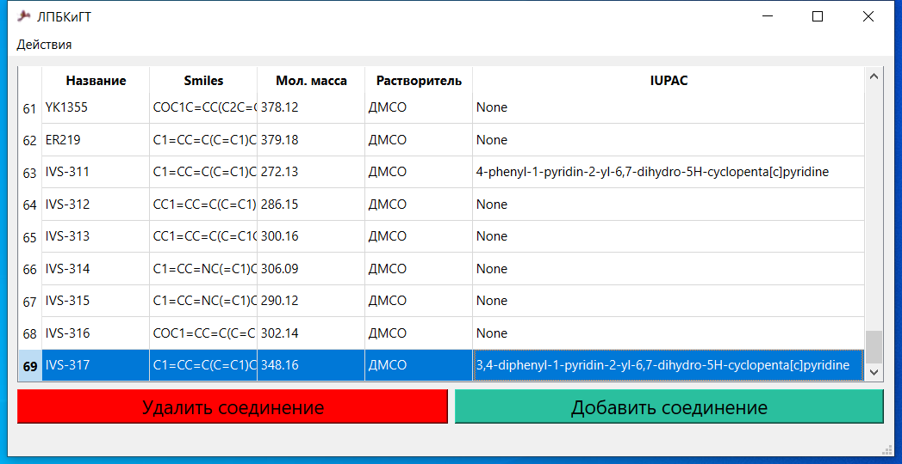
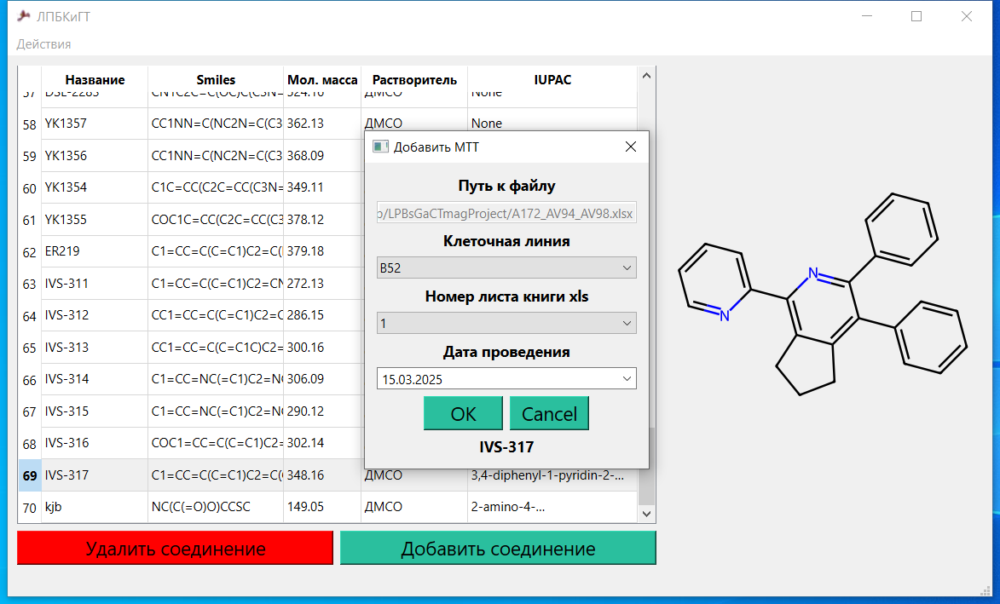
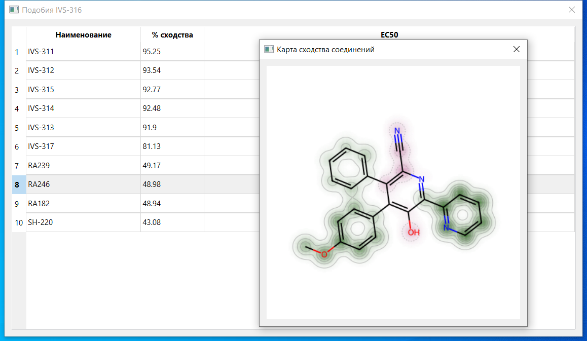

# Учёт экспериментов лаборатории первичного биоскрининга
Цель проекта – создание системы «Учёт экспериментов лаборатории первичного биоскрининга». Информационная система включает в себя:
1. Базу данных исследований
1. Графический интерфейс
1. Средство автоматического расчёта основных показателей эффективности химических соединений на основе входных данных эксперимента
1. Средство графического моделирования химических соединений
1. Средство проектирования графиков статистической обработки
1. Средство анализа и построения карт подобия химических соединений

## Скриншоты:







## Функции приложения:
1. Добавление соединения с помощью графического редактора химических формул или посредством открытия наиболее распространённых файловых форматов (.mol, .sdf, .rdf, .smi)
1. Добавление используемых в экспериментах растворителей и клеточных линий с их последующим автозаполнением
1. Графическое отображение соединений
1. Автоматический расчёт молекулярной массы соединений
1. Отображение тривиальных или IUPAC названий соединений, зарегистрированных в базе данных PubChem
1. Генерация наиболее распространённого дескриптора соединений SMILES
1. Добавление результатов МТТ-тестов соединений и автоматический расчёт индекса цитотоксичности IC50 и статистической ошибки (SE)
1. Построение информативных графиков результата эксперимента
1. Алгоритмический поиск подобных соединений из базы данных для прогнозирования эффективности
1. Построение карт подобия для анализа фармакофоров
Взаимодействие с базой данных по принципу CRUD

## Зависимости
- Python версии 3.6 и выше
- R lang версии 4.3.1 и выше

## Запуск в виртуальном окружении
```
git clone https://github.com/Vofanchik/LPBsGaCTmagProject.git
cd LPBsGaCTmagProject
python venv venv
venv\Scripts\activate
pip install -r requirements.txt
python main.py
```


